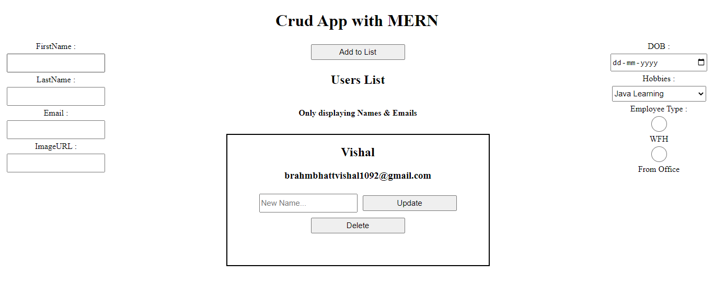
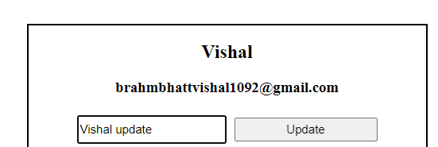
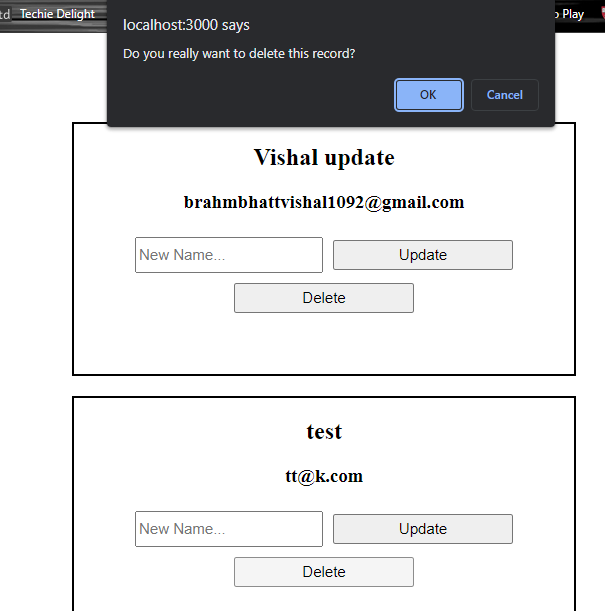

# MERN_CRUD
Repo. for CRUD operation with node js and Mongo with express framework. I've used basic of React JS only with states. Will improve this app in future.

### Update functionality is only for name as of now, I'll include Routes in Future to make dedicated page for update. Also, for for display I'm working on Material UI to Showcase userList better.


## Installation

Install project with npm #### for client

```bash
  npm install 
  npm start 
```
Install project with npm #### for server
```bash
  npm install
  npm run devStart
```

    
## Screenshots


#### Home Page


#### Update User


#### Delete



